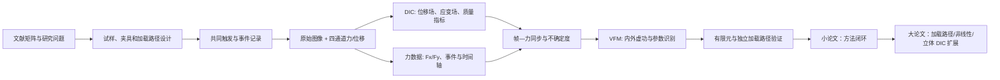

# 总体研究背景与方法框架｜PA12 双轴-DIC-VFM

> 本页回答“为什么做、研究什么、用什么证据和方法、如何形成小论文与大论文”。它是整个项目的稳定研究语境；具体设备参数、试样尺寸、相机配置和结果数值只以当天真实记录、原始数据和对应实验页为准。

## 1. 一句话定位

本研究面向 PA12 试样在多轴受力条件下的本构表征问题：以双轴拉伸/压缩试验制造可控的复杂应力状态，以 DIC 获得全场位移和应变，以同步边界力建立虚功平衡，并以代码化 VFM 识别和验证可用于数值模拟的材料参数。

研究的目标不是展示若干 DIC 彩色云图，而是形成一条可复现的链路：

```text
研究问题与文献证据
  → 双轴加载与共同触发
  → 原始图像、力和位移记录
  → DIC 位移/应变场与质量控制
  → 图像—力事件同步及误差量化
  → VFM 直接反演材料参数
  → 有限元/独立路径验证
  → 可投稿的小论文，再扩展为大论文
```

## 2. 工程与科学背景

工程构件在服役中常处于多方向拉伸、压缩、剪切或其组合状态。单轴拉伸所得的力—位移或应力—应变曲线只描述一种简化加载路径，难以充分约束材料在复杂面内应力状态下的响应。对于 PA12 等聚合物材料，双轴加载下两个方向的应变耦合、横向收缩、局部应变集中、屈服后的演化和潜在损伤，可能与单轴结果不同。

传统试验以力传感器、横梁位移或引伸计为主要证据，能得到整体响应，却不能直接回答：

- 试样有效区是否处于预期的双轴变形状态；
- 局部应变集中何时、何处出现；
- 不同加载路径是否提供足以识别本构参数的独立信息；
- 由整体曲线拟合的参数能否预测局部全场变形；
- 图像帧与载荷错配时，参数识别会产生多大误差。

DIC 使试样表面的位移场和应变场成为可测量数据；VFM 则把这些全场运动学信息与边界载荷通过虚功原理连接起来，直接反演本构参数。二者结合后，研究重心从“观察变形”升级为“由全场实验数据识别并验证材料模型”。

## 3. 研究对象、范围与边界

### 3.1 研究对象

- 材料对象：PA12 试样；材料制备、成型工艺和微观缺陷可作为后续解释变量，但不是当前第一阶段的主问题。
- 受载对象：平面试样在双轴拉伸/压缩系统中的面内响应。
- 研究尺度：以试样有效区的宏观全场位移、应变、边界力和本构参数为主。

### 3.2 已知设备边界

用户提供的设备参数海报显示：双轴拉压载荷范围为 0–10 kN、采样频率为 1 kHz、位移行程标注为 ±150 mm。总额定力还是每轴额定力、实际安全工作区间、夹具边界和控制模式必须以设备说明、校准记录和当次试验记录确认。

### 3.3 当前不作为主线的内容

- 不复现以 3D 打印晶格压溃模式为核心的问题；
- 不把材料制备优化作为本阶段的主要贡献；
- 不因存在工业相机就把二维导出结果表述为立体 DIC；
- 不把尚未核实的照片—力映射或软件识别结果写成正式材料结论。

## 4. 核心科学问题与待检验假设

### 核心问题

1. 双轴试样、加载路径和全场测量能否提供比单轴整体曲线更丰富、可辨识的 PA12 面内变形信息？
2. 在相机与力采样频率不同的条件下，如何建立可追溯的帧—力映射，并量化同步偏移对结果的影响？
3. 能否用全场 DIC 与双轴边界力，通过 VFM 识别物理合理且可独立验证的本构参数？
4. 所识别参数是否能同时解释整体力—位移关系和留出帧/留出加载路径的局部应变场？

### 候选假设

- H1：在边界、标定、ROI 和同步均受控时，双轴全场数据能比单轴整体曲线更有效地约束面内本构参数。
- H2：帧—力映射的不确定性会显著影响 VFM 参数，因而必须作为方法结果而非后台误差处理。
- H3：只在质量合格、加载状态明确且位于适用本构区间的帧内识别，才能获得稳定且物理合理的参数。
- H4：若参数模型成立，其结果应能预测未参与识别的整体反力与全场应变；不能仅以拟合阶段的残差为依据。

这些是假设和研究方向，不是已完成的实验结论。

## 5. 总体方法架构



这条链路中，DIC、同步、VFM 和仿真不是互相替代的关系：DIC 提供运动学测量；力传感器提供边界外力；同步保证二者属于同一状态；VFM 识别参数；有限元用于独立检验参数的预测能力。

## 6. 各方法在研究中的角色

| 方法模块 | 核心输入 | 核心输出 | 在论文中的作用 |
|---|---|---|---|
| 文献矩阵与证据核验 | 全文、DOI、方法与验证信息 | 问题边界、可比较基线、候选缺口 | 证明选题不是“别人较少做”而是存在可验证问题 |
| 双轴试验设计 | 设备、夹具、试样、加载控制 | 加载路径、速率、停止条件、重复设计 | 产生多轴且可辨识的实验状态 |
| 共同触发与事件记录 | 相机、试验机、触发器或时间戳 | 同一时间基准、起载/峰值/结束事件 | 使 DIC 场和力数据可用于同一虚功方程 |
| DIC | 图像、散斑、标定、ROI | 位移场、应变场、R/Sigma 等质量信息 | 揭示局部变形并提供 VFM 内部虚功输入 |
| 力与位移处理 | X1/X2/Y1/Y2 力通道、机器位移 | Fx、Fy、方向平均力、事件窗口 | 提供 VFM 外部虚功与整体响应基线 |
| 帧—力同步 | 图像序列、力时间轴、共同事件 | 每帧候选载荷、同步偏移、可信范围 | 量化而非掩盖同步不确定性 |
| 代码 VFM | DIC 场、边界力、厚度、ROI、虚拟场 | E、ν 或后续非线性参数、残差、敏感性 | 从全场实验直接识别本构参数 |
| 有限元验证 | 识别参数、几何、边界条件 | 反力、位移、应变预测与误差 | 检验参数是否具有预测性，而不仅是拟合性 |
| 不确定度与重复性分析 | 帧偏移、标定、厚度、DIC 质量、重复试样 | 参数区间、稳健性结论 | 支撑投稿时的可信度与适用范围 |

## 7. 实验方法：从双轴加载到可信数据

### 7.1 加载路径

正式加载路径应在预试验后确定，但整体上包括：单方向 X/Y 基线、比例双轴拉伸、必要时的拉伸—压缩组合与不同加载速率。每一条路径应明确：试样编号、几何和厚度、控制模式、速度、目标位移/力、停止条件、重复数和异常记录。

单轴基线的作用是提供材料初步刚度和 DIC 质量参考；双轴加载的作用是制造耦合变形并检验单轴参数是否仍能解释实际多轴响应。

### 7.2 共同硬件触发与事件记录

最优方案是相机曝光或采集信号与试验机数据采集使用同一硬件触发，或至少共享可核对时间戳。每组试验固定记录：

```text
参考帧
首帧加载事件
稳定加载段
峰值力事件
峰后/局部化事件
末帧破坏或有效结束事件
```

无法取得共同触发时，可采用事件锚定和插值建立候选帧—力映射，但必须保留映射方法、候选偏移和误差敏感性；端点插值得到零残差不代表真实同步精度。

### 7.3 DIC 数据处理

DIC 处理遵循固定顺序：散斑与照明检查、标定、ROI 选择、位移场计算、刚体运动检查、应变计算、质量指标筛选和帧级汇总。应变可由位移场的空间梯度获得：

\[
\varepsilon_{xx}=\frac{\partial u}{\partial x},\qquad
\varepsilon_{yy}=\frac{\partial v}{\partial y},\qquad
\varepsilon_{xy}=\frac{1}{2}\left(\frac{\partial u}{\partial y}+\frac{\partial v}{\partial x}\right)
\]

对当前二维基线，须单独检查面外运动风险；若后续获得双视角、空间标定和 `X/Y/Z/U/V/W` 导出，立体 DIC 作为独立扩展分支，不与二维数据混写。

### 7.4 当前 DIC-only 数据的位置

本地 `DIC-xy_0.2` 目录目前有 133 个逐帧二维 DIC CSV；每帧包含 3104 个点的 `X[Pixels]`、`Y[Pixels]`、`U[Pixels]`、`V[Pixels]`、`R` 和 `Sigma`。它已经能支持位移/应变场标准化、质量控制和有效帧筛选。

该目录没有与之明确绑定的双轴力、厚度、真实像素标定和共同触发元数据。因此，现阶段只能形成 DIC 运动学结果，不能声称已完成 VFM 参数识别。末帧出现低相关/失配点时应标记为破坏或跟踪失效候选，而不是不经筛选地进入本构拟合。

## 8. 数据同步方法：论文中的关键质量链

VFM 要求同一加载状态的应变场和边界力配对。同步表必须至少保存：

```text
试验编号、DIC 帧号、相机时间或索引、机器时间或索引、
Fx、Fy、加载类型、首载/峰值/结束事件、同步方法、候选偏移、同步状态
```

统一符号规则为：拉伸为正、压缩为负。双轴 VFM 优先使用 X1/X2/Y1/Y2 的原始通道及其明确的边界归属；方向平均力只用于概要图和辅助检查，不能在缺失边界信息时替代完整外部虚功。

同步分析应至少比较零偏移与若干相邻帧偏移下的识别结果。若参数对很小的帧偏移极其敏感，结论应转向“当前同步不足以支撑该参数模型”，而不是挑选一个最优结果。

## 9. VFM 方法：从全场变形到材料参数

VFM 以虚功原理连接 DIC 与边界力：

\[
W_{\mathrm{int}}^*(\theta)=W_{\mathrm{ext}}^*
\]

\[
\int_{\Omega}\sigma(\varepsilon,\theta):\varepsilon^*\,t\,dA
=
\int_{\Gamma_t}\mathbf{T}\cdot\mathbf{u}^*\,d\Gamma
\]

其中，实际应变 \(\varepsilon\) 来自 DIC，边界力 \(\mathbf{T}\) 来自力传感器，\(t\) 为试样厚度，\(\mathbf{u}^*\) 与 \(\varepsilon^*\) 是代码构造的满足边界条件的虚位移与虚应变，\(\theta\) 为待识别材料参数。

第一阶段采用二维平面应力、各向同性线弹性模型，仅识别 \(E\) 与 \(\nu\)。约束条件固定为：

```text
E > 0
-1 < ν < 0.5
力使用 N，长度和厚度使用 mm，应力使用 MPa
只在质量合格且属于弹性适用区间的帧内识别
```

第二阶段才根据实验结果扩展到正交各向异性、弹塑性、损伤或有限变形模型。VFM 不需要以有限元正向迭代作为第一步，但必须通过有限元或独立加载路径验证识别参数。

## 10. 仿真与交叉验证方法

仿真在本研究中承担“验证”而不是“代替实验”的角色。流程为：

```text
VFM 识别参数
  → 建立与试验一致的试样几何、厚度和边界条件
  → 有限元计算
  → 比较整体反力、位移与 DIC 全场应变
  → 使用未参与识别的帧、载荷段或路径做独立验证
```

一个可接受的参数模型至少应同时报告：整体力—位移偏差、全场应变差异、VFM 虚功残差、参数物理性以及同步/标定/厚度扰动下的稳定性。

## 11. 小论文与大论文的分层

### 小论文：先闭环一个可验证问题

暂定主题为：**基于双轴加载、全场 DIC 与代码 VFM 的 PA12 面内弹性参数识别及图像—载荷同步敏感性分析。**

小论文的最小闭环为：

```text
一类 PA12 试样
+ 明确的二维平面应力加载路径
+ 可审计的帧—力映射
+ DIC 质量控制
+ E、ν 的 VFM 识别
+ 同步偏移敏感性
+ 一项独立验证
```

### 大论文：在稳定闭环上扩展

大论文可逐步增加不同加载比、不同方向分组、拉伸—压缩组合、速率效应、非线性本构、损伤演化、立体 DIC 校核和更完整的参数不确定度分析。小论文的原始数据契约、同步规则、DIC 质量规则和验证框架必须沿用，以保证可比性。

## 12. 当前阶段与下一闸门

当前处于“DIC 全场结果已可读取、VFM 输入尚未闭合”的阶段。下一步不是直接宣称材料参数，而是完成：

1. 将 133 帧 DIC 场转换为固定长表，并生成帧级质量摘要；
2. 确认该 DIC 序列与原始照片、对应试样和双轴力记录之间的关系；
3. 补齐真实 `mm/pixel` 标定、试样厚度、有效 ROI 与四条受力边界；
4. 建立该序列专属的帧—力候选映射；
5. 仅在质量合格的弹性窗口实现第一版代码 VFM；
6. 用留出帧或独立路径验证，再决定是否进入非线性模型。

## 相关执行页

- [工程力学｜双轴试验-DIC-VFM研究路线](../01_项目入口/工程力学-双轴DIC-VFM研究路线.md)
- [阶段 1｜候选方向证据决策](阶段1-候选方向证据决策-2026-09-12.md)
- [阶段 1｜文献矩阵交叉对比与创新候选](阶段1-文献矩阵交叉对比与创新候选-2026-09-13.md)
- [双轴-DIC-VFM｜同步采集与预试验方案](../../02_实验与VFM/01_方法与输入/双轴-DIC-VFM-同步采集与预试验方案.md)
- [VFM 软件识别闭环与本构参数验收](../../02_实验与VFM/01_方法与输入/VFM软件识别闭环与本构参数验收.md)
- [yuan｜仿真与实验数据深入分析](../../04_文献与工具/03_yuan审计/yuan-仿真与实验数据深入分析-2026-09-12.md)
