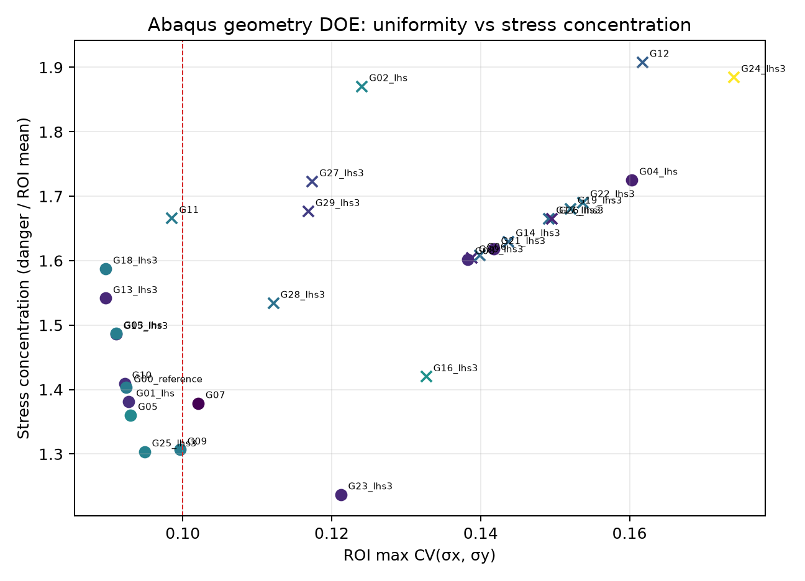
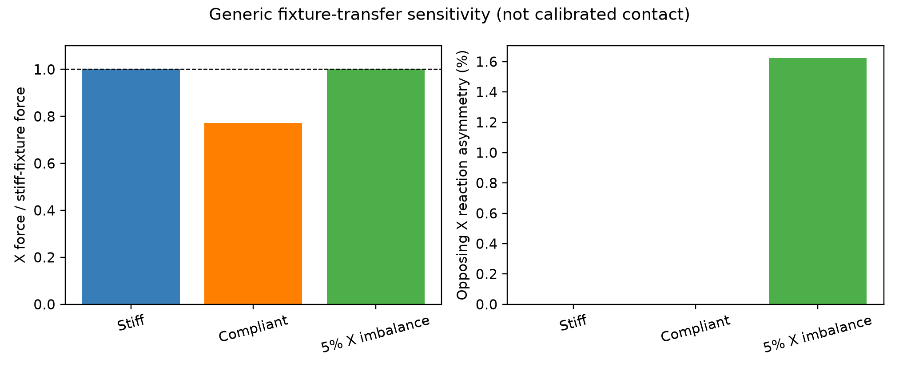
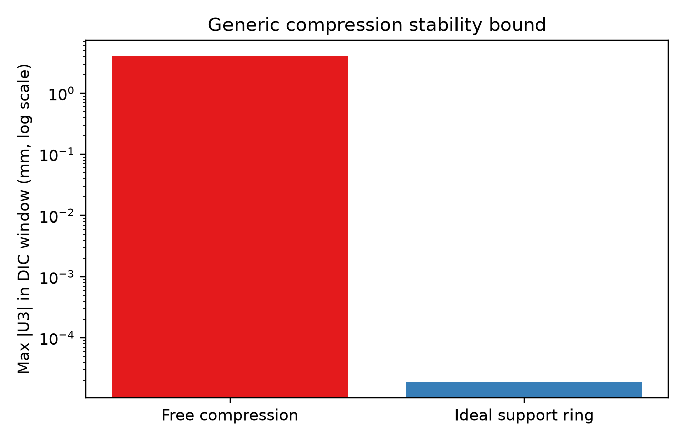

# 双轴试样与夹具仿真优化：46篇文献交叉学习与 Abaqus 结果

> **范围声明（2026-09-17 更新）**：本页的 ODB/DOE 是通用敏感性基准，不是当前 PA12 中心试样的定量结论。真实试样的主证据、MatchID ROI、力学记录和 VFM 输入边界统一见[真实 PA12 中心试样｜证据与建模契约](../../02_实验与VFM/01_方法与输入/真实PA12中心试样-证据与建模契约-2026-09-17.md)。

## 当前结论

本轮没有把范围限制在 PA12，而是交叉读取金属、复合材料、聚合物及全场识别研究。结构化矩阵共 46 篇，其中 17 篇发表于 2023—2026 年，29 篇达到全文方法层级，16 篇记录了可直接转化为建模变量、边界条件或验收指标的全文证据。

跨材料后仍然成立的设计原则是：

1. **试样几何不能只优化中心均匀性。** 中心 ROI 均匀性、过渡区应力集中、危险点位置和参数可辨识性需要同时保留；完全均匀的场不一定最适合 VFM。
2. **夹具是模型的一部分。** 四轴顺应性、对向不平衡、偏心、夹持接触和压缩防屈曲会改变载荷传递、中心场和识别结果，不能永远用理想端位移替代。
3. **拉伸与压缩要分层验证。** 拉伸候选不能自动视为压缩候选；压缩必须额外检查初始缺陷、面外位移、防屈曲支撑和 DIC 视窗。
4. **仿真优化必须用独立路径复核。** 等双轴用于筛选，非等双轴和单轴/压缩路径用于验证；机器学习只能提出候选，不能替代真实 Abaqus 求解。

文献方法背景和关键出处见上一版[文献与方案页](双轴试样与夹具仿真优化-文献与Abaqus方案-2026-09-15.md)。本页只记录已经执行的仿真和下一步决策。

## 已完成的 Abaqus 工作

### A 层：试样几何筛选

- 30 个独立参数化十字形设计，每个均计算等双轴、非等双轴和单轴路径，共 90 个设计—路径 ODB；另有 1 个方形基准 ODB。
- 91 个状态文件均含 `THE ANALYSIS HAS COMPLETED SUCCESSFULLY`，当前无锁文件。
- 所有 90 个设计—路径结果的 VFM 设计矩阵秩均为 4；最大合成参数恢复误差约 5.66%，最大内外虚功相对差约 0.0474%。这只证明数值闭环可运行，不代表真实 PA12 已识别。
- 当前 Pareto 候选包括 G13、G15、G10、G25 和 G07；它们应作为下一轮真实尺寸建模的起点，而不是直接加工图纸。

### B 层：夹具传力敏感性

以 G25 为参考几何，新增 3 个完整 Abaqus/Standard 算例。当前模型用等效轴向柔度表示夹具传力，尚未冒充真实摩擦接触：

| 算例 | 设置 | X 向平均反力 | 相对刚性夹具 | 对向 X 反力不对称 |
|---|---:|---:|---:|---:|
| 刚性基准 | 总刚度 100000 N/mm | 133.38 N | 100.00% | 0.00% |
| 柔顺夹具 | 总刚度 1000 N/mm | 102.89 N | 77.14% | 0.00% |
| X 向不平衡 | 刚性基准、两侧执行位移相差 5% | 133.38 N | 100.00% | 1.62% |

结果说明：若实际夹具具有明显柔度，而仿真仍直接把机器位移施加到试样端部，会高估传入试样的载荷；执行器位移不平衡也会产生可观测的反力不对称和热点变化。

### C 层：双轴压缩稳定性边界

新增 2 个带 0.02 mm 初始面外缺陷的 S4R 壳模型：自由压缩和带中心 DIC 窗口的理想支撑环。两者均完成求解。

| 算例 | DIC 窗口内最大绝对面外位移 | 中心应力 CV | 解释 |
|---|---:|---:|---|
| 自由压缩 | 4.0166 mm | 约 9.71 | 面外失稳主导，不能作为 2D DIC/VFM 有效工作段 |
| 理想支撑环 | 0.0000193 mm | 约 0.090 | 理论支撑上界；真实夹具必须再加入间隙、摩擦与接触 |

这个对比不能证明当前支撑环就是最终夹具，但证明了压缩支路不能省略防屈曲设计。真实方案应在不遮挡中心 DIC 视窗、不把接触力引入目标 ROI 的前提下，寻找足够而不过度的面外约束。

## 机器学习代理模型的真实状态

所有训练数据均来自已经成功完成的 Abaqus ODB，按独立几何分组；6 个几何在模型选择前预留为独立测试集。Ridge、Extra Trees、Random Forest、Histogram Gradient Boosting 和两种 Gaussian Process 已比较。

独立留出集未达到 90% 精度门：

| 响应 | 最佳模型 | 留出平均相对误差 | 留出最大相对误差 |
|---|---|---:|---:|
| 中心场不均匀度 | GPR-RBF | 22.97% | 40.14% |
| 应力集中系数 | GPR-Matérn | 11.70% | 27.92% |
| VFM 条件数 | Random Forest | 11.78% | 38.64% |

因此代理模型状态固定为 `EXPLORATORY_NOT_FOR_CLAIMS`。它可以帮助选择下一批 Abaqus 采样点，但不能代替求解器，也不能写成论文的高精度预测结果。下一轮若扩充 DOE，必须继续使用真实 ODB，并保留全新几何作为最终测试集。

## 当前推荐方案

### 试样

以 G13、G15、G10、G25 和 G07 作为候选族，围绕以下变量做第二轮局部 DOE：中心厚度比、中心宽度比、臂宽比、渐变长度、过渡圆角和狭缝长度。评价目标保持原始多目标，不压成一个不可解释的总分：

- ROI 内 `σx、σy、εx、εy` 的 CV；
- 过渡区热点相对 ROI 均值的集中系数；
- 危险点是否位于计划的 DIC/失效区域；
- 四端反力对称性；
- VFM 矩阵秩、条件数、噪声敏感性和独立加载路径误差；
- 压缩时的面外位移和接触状态。

### 夹具

下一版真实夹具模型应按复杂度逐层增加，而不是一次把所有未知量塞入模型：

1. 用实测空载/刚性件校准四轴等效刚度；
2. 加入实际夹持长度、销孔或夹板尺寸和夹具刚体；
3. 由预紧方式确定接触压力，再扫描可解释的摩擦范围；
4. 单独施加一侧位移/刚度偏差，建立反力不对称—中心场偏差关系；
5. 压缩模型加入真实防屈曲板间隙和中心观察窗，验证接触不进入 ROI。

### 最小实验验证

真实试验第一次不要直接冲到破坏。先做低载验证：四端位移—反力、中心 DIC 场、刚体位移和面外风险同时记录；用同一边界历史驱动 Abaqus。只有载荷传递和中心场趋势都对上，才进入材料参数反演和破坏预测。

## 下一批必须由真实信息替换的输入

1. 当前十字形试样的实际尺寸、厚度分布和夹持区结构；
2. 四个夹具的受力链尺寸、夹持方式、预紧或销孔信息；
3. 空载/刚性连接件试验得到的四轴等效刚度与对中偏差；
4. PA12 单轴拉伸/压缩曲线及其方向、速率、温湿度；
5. 双轴目标加载比和有效工作载荷；
6. 防屈曲件允许的中心 DIC 观察窗、间隙和接触材料。

这些输入补齐后，当前参数化脚本可直接把“通用基准”升级为“真实 PA12 试样—夹具模型”。在此之前，现有结果用于淘汰不合理设计和确定测量重点，不用于宣称最终尺寸、真实失效载荷或 90% 实验一致性。

## 本地可复现资产

全部 Abaqus 输入、ODB、状态文件、派生 CSV、代理模型和图片均保存在 D 盘：

`双轴/实验/PA12-双轴-DIC-VFM/simulation/fixture_optimization/`

公开 GitHub 只推送本决策页与不含原始数据的汇总图；ODB、原始场、用户实验数据和私有资料继续只保存在本地。
