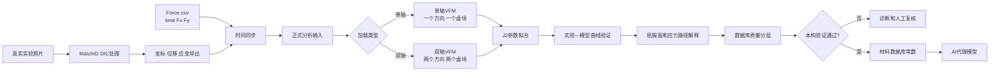

# PA12｜从真实照片到可验证材料本构的完整流程

这是给汇报和理解项目使用的主线，不按阶段编号讲，而是从实验照片一直讲到材料本构是否可以被接受。

## 一句话总览

真实照片先经过 MatchID 得到 DIC 位移/应变场；再把 Force.csv 与相机帧时间对齐；之后用虚功法把 DIC 场和边界力联系起来；最后用 J2 本构模型拟合实验曲线，并经过数据、虚功、参数和独立曲线检查，决定结果能否进入材料数据库或 AI 代理模型。



## 1. 真实实验照片：研究的起点

输入是 PA12 试样在加载过程中的真实照片序列。照片本身只有纹理变化，不能直接给出材料参数，因此要先进行 DIC。

必须保留原始照片、照片编号、实验编号、相机帧号、相机硬件时间、试样几何和厚度。原始照片不能用生成数据替代，也不能为了曲线完整而补造缺失帧。

## 2. MatchID：只负责把照片变成 DIC 场

MatchID 从照片得到坐标 `x、y、z`、位移 `u、v、w`、应变 `exx、eyy、exy`、帧号和时间信息。`MatchID_Interface` 读取和整理导出的 `.dat`，检查字段、坐标、帧完整性和可用点数。

这里的输出仍然是测量场，不是材料本构，也不是 VFM 参数。

## 3. Force.csv：给 DIC 场配上真实边界力

Force.csv 至少包含：

```text
time,Fx,Fy
```

需要检查时间单位、采样频率、起始时间、结束时间、力的正负号，以及单轴实验的次要方向是否接近零。相机时间采用用户确认的正确硬件端点和逐帧时间基准，不擅自再造时间轴。

## 4. 时间同步：把“第几帧”变成同一时刻的力

同步后的记录至少包含 `frame_id、time、Fx、Fy`。这样第 `frame_id` 帧的 DIC 应变和同一时刻的边界力才可以放进同一个虚功方程。同步错误会使后面所有曲线看起来有趋势但不闭合。

## 5. 正式分析输入：把所有量放在同一张表

`formal_vfm_input.csv.gz` 将坐标、位移、应变、时间和同步后的 `Fx/Fy` 放在统一记录中，防止 DIC 和 Force 使用不同帧范围，并让每条曲线追溯回原始帧和实验编号。

## 6. 先判断是单轴还是双轴

如果一个方向是主要加载方向、另一个方向的力足够小，才可以使用单轴假设。若 `Fx` 和 `Fy` 都明显存在，就不能强行当成单轴问题。

单轴 VFM 使用一个主要加载方向和一个虚位移场；双轴 VFM 使用两个方向的虚场和两个方向的力，至少得到 `σxx` 和 `σyy` 的约束。仅有 `Fx/Fy` 两个合力，不能独立可靠确定完整的 `τxy` 边界牵引。

## 7. VFM：用虚功把 DIC 和 Force 连接起来

$$W_{int}=\int_{\Omega}\boldsymbol{\sigma}:\delta\boldsymbol{\varepsilon}^{*}\,d\Omega$$

$$W_{ext}=\int_{\Gamma_t}\mathbf{t}\cdot\delta\mathbf{u}^{*}\,d\Gamma$$

理想情况下同一帧应满足 `Wint≈Wext`。


上图比较内部虚功和外部虚功，下图画两者的差。当前差值仍大，所以这是闭合性诊断图，不是已经验证成功的证明图。


双轴图同时检查 x、y 两个方向；两个方向的残差都需要能解释。

## 8. J2：用一个材料模型解释曲线

$$f=\sqrt{\frac{3}{2}\mathbf{s}:\mathbf{s}}-\sigma_y(\bar\varepsilon^p)\le 0$$

`E` 控制初始斜率，`ν` 控制横向变形，`σy` 控制第一次屈服门槛，`H` 控制屈服后的硬化幅度，`n` 控制硬化曲率。拟合就是调整这些参数，使模型预测的力—位移、横向应变和虚功残差尽量接近真实实验。


上半部分看实验和模型是否接近，下半部分看误差是否围绕零。残差必须保留，不能通过改坐标或删点隐藏。

### 线弹性与塑性/硬化模型的真实拟合比较

为了对应材料模型编辑界面中常见的选项，已对真实单轴加载支路分别拟合：线弹性、J2理想塑性、J2线性硬化、J2幂硬化（Ludwik）和J2 Voce硬化。输入文件为 `single_axis_real_stress_strain_data.csv`，没有加入任何合成实验。


主数据 `XY_X-06-1.0-01` 和 `XY_X-07-10-01` 的五条模型线几乎重合；塑性模型的 `σy` 触碰当前上界。这不是“塑性模型失败”，而是当前可用加载区间更像弹性段，尚不足以唯一识别屈服和硬化。完整参数、RMSE、MAE、边界触碰状态见 [真实单轴模型拟合报告](../实验/PA12-双轴-DIC-VFM/reports/real_model_fits/real_constitutive_model_fits.json)。

主数据的线弹性参考拟合为：`XY_X-06-1.0-01` 的 RMSE 约 `0.634 MPa`，`XY_X-07-10-01` 的 RMSE 约 `0.826 MPa`；五种模型在这两个加载支路上的RMSE几乎相同。这个结果说明当前差异主要来自真实曲线中的台阶、噪声和应变分辨率，而不是模型类别已经被数据区分出来。

## 9. 屈服面：把曲线放进应力空间

绿色是初始屈服面，紫色是硬化后的屈服面，彩色点是真实实验应力路径。路径接近或接触屈服面，表示材料进入塑性区。


当前这些图使用真实实验识别参数，但由于没有实验达到 `constitutive_validated`，只能称为诊断性屈服面。

## 10. 为什么选择 5 组，排除 5 组

保留到质量数据库的 5 组是：`XY_X-06-1.0-01`、`XY_X-07-10-01`、`XY_Xy-0.1-01`、`XY_Xy-03-10-01`、`XY_Xy-04-1-01`。共同原因是 DIC、Force、同步和正式分析输入完整。

没有进入质量数据库的 5 组是：

| 实验 | 原因 |
|---|---|
| `XY_X-05-0.1-01` | 只有151个可用 `.dat` 帧，正式输入和 Force 闭合不完整 |
| `XY_XY-0.1-02` | 缺正式分析输入 |
| `XY_Y-09-0.1-02` | 联合力相对 RMSE约0.395 |
| `XY_Y-10-1-01` | 联合力相对 RMSE约0.416 |
| `XY_Y-11-10-01` | 加载支路非单调 |

保留不等于验证通过；排除也不等于数据被删除。排除实验仍保存在审计记录中。

## 11. 为什么 Y-09/Y-10 的两种曲线不一样


只拟合轴向力时，J2 可以跟随实验平台段；加入横向 DIC 应变后，模型同时要满足两个约束，结果出现冲突。当前需要人工复核横向 DIC、平面应力、几何、厚度、边界传力和加载方向。

## 12. MatchID 是否可以完全舍弃

推荐长期分工：MatchID 负责照片到 DIC 场的计算和导出；本项目 Python 管线负责字段解析、Force同步、VFM、J2、验证、数据库和后续 AI；MatchID 内置 VFM 暂时保留作独立交叉检查。

因此可以不再依赖 MatchID 内置 VFM 完成最终计算，但现在不建议删除它或完全不做交叉校验，因为当前虚功残差和边界假设还没有完全闭合。

## 13. 从现在到结束还差什么

1. 人工确认横向 DIC 的符号、ROI、厚度、几何和边界传力。
2. 重新检查单轴/双轴虚功闭合。
3. 只有参数不触边、残差可接受且不同实验能重复时，才把实验升级为可验证本构。
4. 建立至少一组 `constitutive_validated` 数据后，再开放材料数据库常数层。
5. 数据足够且本构验证通过后，才训练 AI 代理模型。

当前状态：`quality_passed=5`，`constitutive_validated=0`，`diagnostic_only=8`，正式 AI 训练门关闭。

## 14. 记录和证据

- [中文讲解图集](PA12-J2与VFM讲解图集-2026-09-19.md)
- [历史错误经验与防错规则](PA12-历史错误经验与防错规则-2026-09-19.md)
- [真实单轴问题总审计](PA12-真实单轴问题总审计-2026-09-19.md)
- [中文图文讲解 PPT 框架](PA12-中文讲解PPT框架-待确认-2026-09-19.md)
- [中文图文讲解 PPT](../实验/PA12-双轴-DIC-VFM/reports/PA12_真实DIC_VFM_J2_全流程中文讲解.pptx)
- [中文PPT PDF预览](../实验/PA12-双轴-DIC-VFM/reports/PA12_真实DIC_VFM_J2_全流程中文讲解.pdf)
- [真实单轴模型拟合报告](../实验/PA12-双轴-DIC-VFM/reports/real_model_fits/real_constitutive_model_fits.json)
- [真实图集清单](../实验/PA12-双轴-DIC-VFM/reports/explanation_figures/figure_manifest.json)
- [真实数据质量审查](../实验/PA12-双轴-DIC-VFM/reports/phase12_1_audit/phase12_1_data_constitutive_audit.json)
- [数据库分层](../实验/PA12-双轴-DIC-VFM/reports/phase12_3_database_stratification.json)
- [PA12数据库](../实验/PA12-双轴-DIC-VFM/PA12_database.h5)
