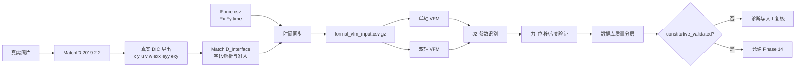

# PA12｜真实 DIC–VFM–J2 全流程总览与当前状态

## 先给结论

这项工作已经完成了“真实 MatchID/DIC 数据 → Force 同步 → 单轴/双轴 VFM → J2 参数识别 → 实验数据库 → 质量审查”的真实数据闭环，但还没有完成“已验证 PA12 本构”的闭环。

当前最重要的事实是：

- 已接入真实 MatchID 2019.2.2 的 DIC 导出数据。
- 已建立独立的 Python VFM 计算模块。
- 已建立 J2 von Mises 弹塑性识别模块。
- 已建立真实实验 HDF5 数据库。
- `quality_passed=5`，但 `constitutive_validated=0`。
- Phase 14 正式 AI 训练门保持关闭，之前的 AI 结果只能叫 pilot。
- 原始 DIC、Force 和照片没有被 synthetic 数据替换。

## 1. 现在的系统到底是什么

### MatchID 和本项目模块的分工

| 部分 | 负责什么 | 当前状态 |
|---|---|---|
| MatchID 2019.2.2 | 从照片得到位移、应变和坐标 | 已完成真实数据导出 |
| `MatchID_Interface` | 读取 `.dat`、识别字段、生成正式输入 | 已建立 |
| Force 接口 | 读取 `Force.csv` 并检查时间/采样/端点 | 已建立 |
| 时间同步 | 把相机 frame time 对齐到 Force time | 已建立；相机首末帧端点估计按用户说明视为硬件正确时间 |
| Python 单轴 VFM | 用单轴虚功方程求解 | 已建立，结果仍需质量解释 |
| Python 双轴 VFM | 用 `Fx/Fy` 和双轴应变建立二维虚功方程 | 已建立；`τxy` 受边界合力不足限制 |
| J2 识别 | 调整 `E、ν、σy、H、n` 拟合实验 | 已建立，当前为诊断性识别 |
| MatchID 内置 VFM | 商业软件内部的虚场/VFM工作流 | 没有被自动接管或替代验证 |

## 2. 我们到底做了哪些 Phase

| 阶段 | 实际做的事 | 结果 |
|---|---|---|
| Phase 6 | 读取真实 MatchID `.dat`，检查字段和帧 | 真实 DIC 数据进入独立管线 |
| Phase 7 | 接入 `Force.csv`，检查时间和采样，生成同步输入 | `formal_vfm_input.csv.gz` 建立 |
| Phase 8 | 单轴虚功求解 | 数值可运行，但单轴适用性和虚功残差必须审查 |
| Phase 9 | J2 `least_squares` 参数识别 | 得到参数和力–位移曲线，但参数可能触边 |
| Phase 10 | 实验曲线与模型曲线比较 | 识别残差被量化，不隐藏偏差 |
| Phase 11 | 双轴 `Fx/Fy` 虚功平衡 | 得到 `σxx/σyy`；`τxy` 不能仅由合力独立确定 |
| Phase 12 | 单轴+双轴联合识别 | 能收敛不等于参数唯一或本构有效 |
| Phase 13 | 写入 HDF5 数据库 | 真实数据、历史、参数和排除审计分开保存 |
| Phase 13.5 | 检查 experiment_id、DIC、Force、VFM完整性 | 5 组质量通过，5 组被排除 |
| Phase 12.1–12.3 | 重新审查数据、几何、边界、模型阶梯和数据库分层 | 0 组达到 `constitutive_validated` |
| Phase 14 | MLP 代理模型 | 只完成过 pilot；正式恢复门关闭 |

相关记录：[[Phase6-真实MatchID数据接入-2026-09-18]]、[[Phase7-实验力值闭合-2026-09-18]]、[[Phase8-真实单轴VFM求解-2026-09-18]]、[[Phase9-PA12弹塑性参数识别-2026-09-18]]、[[Phase11-二维双轴VFM-2026-09-18]]、[[Phase12-单轴双轴联合识别-2026-09-18]]、[[Phase12.1-真实数据本构审查与模型阶梯-2026-09-19]]。

## 3. 为什么选这 5 组进入质量数据库

Phase 13.5 的 `quality_passed` 只表示：真实 DIC、Force、同步和正式 VFM 输入存在，数据可以进入质量数据库；它不表示材料参数已经验证。

进入 `PA12_database.h5` 的 5 组是：

| experiment_id | 类型 | 为什么保留 | 当前本构状态 |
|---|---|---|---|
| `XY_X-06-1.0-01` | x 单轴 | DIC/Force/formal完整，加载支路可用 | diagnostic_only；`ν`触下界 |
| `XY_X-07-10-01` | x 单轴 | DIC/Force/formal完整，加载支路可用 | diagnostic_only；`ν`触下界 |
| `XY_Xy-0.1-01` | 双轴 | 289帧真实数据、Force和二维应变完整 | diagnostic_only；VFM残差较大 |
| `XY_Xy-03-10-01` | 双轴 | formal和Force完整 | diagnostic_only；只有8个单调加载帧，`E`触上界 |
| `XY_Xy-04-1-01` | 双轴 | 253个正式可用帧，加载支路完整 | diagnostic_only；参数触边且虚功残差较大 |

## 4. 为什么没有选另外 5 组进入质量数据库

| experiment_id | 没有进入的原因 | 处理方式 |
|---|---|---|
| `XY_X-05-0.1-01` | 只有151个可用 `.dat` 帧，formal/Force闭合不完整 | 不补 synthetic，不写入正式历史 |
| `XY_XY-0.1-02` | 缺少正式 `formal_vfm_input` | 记录为排除实验 |
| `XY_Y-09-0.1-02` | Phase 12 联合力相对 RMSE≈0.395 | 保留作诊断，不作为已验证材料 |
| `XY_Y-10-1-01` | Phase 12 联合力相对 RMSE≈0.416 | 保留作诊断，不作为已验证材料 |
| `XY_Y-11-10-01` | 加载支路非单调，不能直接作为单调本构识别样本 | 保留审计，不进入质量样本 |

另外，`XY_Xy-03-10-01` 虽然进入 `quality_passed`，但只有 8 个加载帧，因此不能被解释为可靠的本构验证样本。

## 5. 为什么生成这些图像

| 图像 | 目的 | 应该怎么看 | 当前含义 |
|---|---|---|---|
| J2拟合与残差 | 说明参数是如何拟合的 | 蓝线实验，橙线模型，下图看残差 | X-06拟合较接近，但不是全局验证 |
| 单轴VFM虚功 | 检查 `Wint≈Wext` | 两条虚功曲线是否重合 | 当前仍有明显不闭合 |
| 双轴VFM虚功 | 同时检查 x、y 两个方向 | 看四条功曲线和两个残差 | 双轴边界近似仍需解释 |
| 屈服面 | 说明弹性、屈服和硬化 | 绿面初始，紫面硬化，彩点应力路径 | 当前识别参数的诊断屈服面 |
| 联合/力-only比较 | 定位高残差来源 | 对比只拟合力和加入横向DIC后的差异 | Y-09/Y-10主要是观测约束冲突 |
| 流程图 | 让汇报听众理解数据链 | 从DIC→Force→VFM→J2→验证 | 方法框架，不是实验曲线 |

图集入口：[[PA12-J2与VFM讲解图集-2026-09-19]]。

## 6. 现在是否已经“接入 MatchID 的 VFM 模块”

准确说法是：**已经接入 MatchID 的真实 DIC 数据接口，并建立了自己的 Python VFM 模块；没有自动接管 MatchID 商业软件内部的 VFM 模块。**

因此当前工作流是：

1. MatchID 负责照片 → DIC 坐标、位移、应变。
2. 本项目负责 `.dat` 字段读取、Force 同步、formal 输入、VFM、J2、数据库和验证。
3. MatchID 内置 VFM 可以作为交叉检查，但不是当前 Python 结果的来源。

### 是否可以舍弃 MatchID VFM

可以把 MatchID 的工作范围缩小为“DIC 获取和导出”，以后主要使用本项目完成 VFM 和本构识别；但当前不建议删除或完全舍弃 MatchID 内置 VFM，原因是：

- 它可以作为虚场、边界定义和应力结果的独立交叉检查。
- 当前 Python VFM 的虚功残差还没有闭合到可验证程度。
- 双轴 `τxy` 的边界信息仍不充分，MatchID 结果可以帮助定位边界定义差异。

推荐最终分工：**MatchID 做 DIC；Python 管线做同步、VFM、J2 和数据库；MatchID VFM 暂时保留为校核工具。**

## 7. 当前真正的阻塞点

不是“有没有跑出曲线”，而是以下质量门还没有全部通过：

1. 横向 DIC 应变的符号、ROI、厚度和几何口径需要人工复核。
2. 单轴 VFM 的 `Wint-Wext` 仍然较大。
3. 双轴 VFM 的边界合力近似不足以独立得到剪切响应。
4. 多个实验参数触及边界，参数唯一性未证明。
5. `constitutive_validated=0`，因此不能把 J2 参数当作最终 PA12 数据库常数。

## 8. 当前目标执行状态

- [x] 固化真实数据流程和数据来源边界
- [x] 记录数据保留与排除依据
- [x] 记录历史错误及防错规则
- [x] 解释 J2、单轴 VFM、双轴 VFM 和图像含义
- [x] 建立全中文 PPT 框架
- [ ] 用户确认总览、数据分层和 PPT 框架
- [ ] 用户确认后生成全中文讲解 PPT

## 9. 主要证据文件

- [Phase 12.1 审查](../实验/PA12-双轴-DIC-VFM/reports/phase12_1_audit/phase12_1_data_constitutive_audit.json)
- [Phase 12.2 模型阶梯](../实验/PA12-双轴-DIC-VFM/reports/phase12_2_model_ladder/phase12_2_model_ladder.json)
- [Phase 12.3 数据库分层](../实验/PA12-双轴-DIC-VFM/reports/phase12_3_database_stratification.json)
- [PA12_database.h5](../实验/PA12-双轴-DIC-VFM/PA12_database.h5)
- [真实图像审计](../实验/PA12-双轴-DIC-VFM/reports/phase13_14_real_figures/figure_audit.json)
