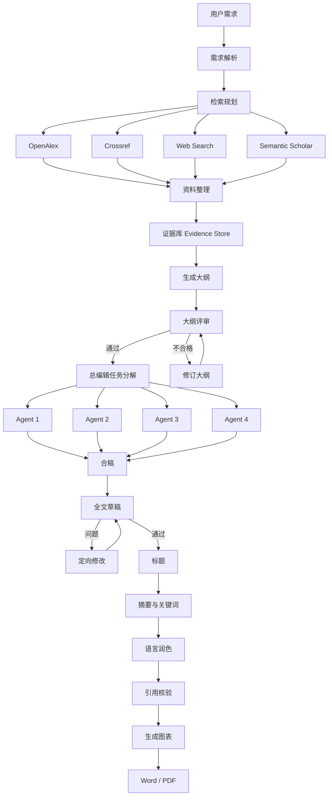

# 总体流程与当前范围

这张流程图是 Math Agent 的上层业务框架。它描述完整目标，不表示所有节点在第一版同时启用。系统采用逐阶段实现，当前重点仍是文献搜索、资料研读和证据库。

## 流程图转写



## 图中每个阶段的职责

### 1. 用户需求 → 需求解析

把研究主题、论文类型、目标期刊、研究方向、已有材料和数据条件整理成项目输入。需求解析阶段必须产出研究问题候选、范围边界、资料需求和无法假设的事项。

### 2. 检索规划 → 四类来源

总编辑或检索规划节点生成检索词、时间范围、文献类型和来源优先级。OpenAlex、Crossref、Semantic Scholar 负责结构化文献记录，Web Search 负责政策、教材、机构页面和公开网页线索。四路检索结果先进入统一资料整理，不直接进入论文正文。

### 3. 资料整理 → Evidence Store

资料整理完成去重、DOI 核对、全文获取、PDF/网页解析、段落切分和文献卡片。Evidence Store 保存“论断—原文片段—出处定位—适用边界”，而不是只保存摘要。未完成全文研读的记录必须带有明确状态，不能伪装成已核验证据。

### 4. 生成大纲 → 大纲评审

大纲只能引用已进入 Evidence Store 的内容。大纲评审检查研究问题是否聚焦、章节是否覆盖问题、方法和结论是否匹配、每章是否有证据来源。评审不合格时只回到修订大纲，不跳过评审直接写作。

### 5. 总编辑任务分解 → Agent 1–4

图中的 Agent 1–4 是动态任务槽位，不是固定的四个性格或四个永久角色。总编辑依据大纲按章节创建任务，每个任务写明章节目标、允许读取的 evidence_id、输出结构、禁止越界内容和验收标准。实际运行时可以是 2 个、4 个或更多 Worker，但数量由大纲和任务量决定。

### 6. 并行写作 → 合稿

各 Worker 只写分配的章节，不自行改研究问题、增设变量或扩大检索范围。合稿节点负责统一术语、章节衔接、论证主线和重复内容；它不能替原文证据补造不存在的结果。

### 7. 全文草稿 → 定向修改

全文草稿通过 Reviewer 和 Citation 检查后才继续生成标题、摘要、语言润色和图表。发现问题时，修订任务必须绑定到具体章节、段落、论断或引用，修订后回到全文草稿重新检查。

### 8. 标题 → Word/PDF

标题、摘要、关键词依赖已经通过检查的全文草稿。图表先保留结构规格和可编辑源文件，再生成 SVG/PNG。Word/PDF 是导出物，不是事实来源；可追溯证据和版本仍保留在项目库中。

## 当前实现范围

当前只启用图中的前半段：

```text
用户需求
→ 需求解析
→ 检索规划
→ OpenAlex/Crossref/Web Search/Semantic Scholar
→ 资料整理
→ 证据库 Evidence Store
```

当前阶段的交付物是文献库、解析文本、文献卡片、证据卡片、证据矩阵和待核查清单。大纲和写作节点先保留接口与状态，不提前批量生成论文。

## 后续开启条件

- Evidence Store 中的关键文献完成结构化研读。
- 主要论断都有原文定位和适用边界。
- 研究问题和范围经过人工确认。
- 大纲评审通过后，才开启总编辑任务分解。
- 章节写作完成并通过审稿、引用核验后，才开启摘要、图表和 Word/PDF 导出。

## 与 Agent 防跑偏规则的对应关系

| 图中节点 | 范围控制 |
|---|---|
| 需求解析 | 锁定项目宪章和研究问题候选 |
| 检索规划 | 固定关键词、来源和检索边界 |
| 资料整理 | 只整理来源，不生成未经证据支持的结论 |
| Evidence Store | 所有可写论断必须可回到原文 |
| 总编辑任务分解 | 每个任务限定输入、证据和输出 |
| Agent 1–4 | 只完成被分配的章节任务 |
| 合稿 | 统一主线和术语，不改变证据含义 |
| 大纲/全文评审 | 不通过就回到指定修订节点 |
| 定向修改 | 按具体问题修改并保留版本 |
| Word/PDF | 只导出已通过检查的内容 |
