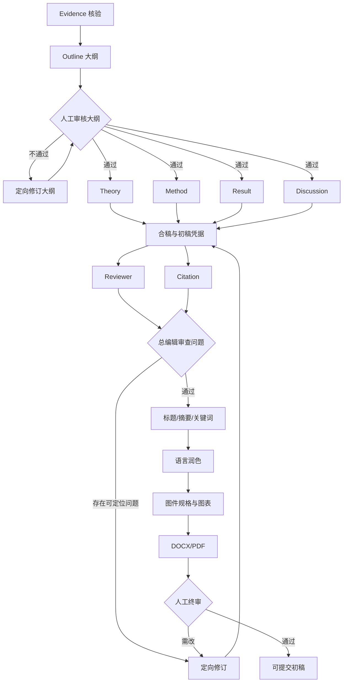

# 2026-09-14 总编辑任务分解：从证据到初稿

> 本笔记把完整流程中“证据核验 → 初稿 → 审稿修订 → 初稿导出”拆成可调度的任务契约。它服从 [[科研论文/Math Agent/01_选题与范围/研究问题卡片]]、[[科研论文/Math Agent/00_项目总览/阶段策略与范围护栏]] 和 [[科研论文/Math Agent/00_项目总览/总体流程与当前范围]]。

## 一、当前总编辑判断

当前首轮题目仍是“新版人教版一年级下册《十几减9》课内分层练习设计与质量评价”。如果尚未确认教材版本、课时范围、分层依据和评价维度，流程停在需求/范围审核，不能直接生成大纲。

从代码现状看：

- `SupervisorPlanner.plan(state)` 已能依据 `CompletionAuditor` 的下一个可执行阶段生成 `TaskRequest`。
- `WRITING` 阶段目前会并行生成 Theory、Method、Result、Discussion 四个章节任务；每项任务共享项目证据 ID，但仍需由合稿后置条件确认四章是否齐全、术语是否一致、主线是否一致。
- `REVIEW` 阶段目前会并行生成 Reviewer 和 Citation 两个检查任务。
- `TaskGate` 要求写作、审稿、修订、图件和导出任务绑定证据 ID，并检查项目、阶段前置条件以及 source/evidence 可用范围。
- `CompletionAuditor` 以显式阶段凭据判断完成，不把 `current_stage` 当作完成证明；修订分支只在实际进入时插入流程。
- 现有阶段枚举没有单独的“合稿、标题、摘要、关键词、语言润色、引用核验”阶段，因此本笔记把它们定义为 `WRITING` 后置或 `REVIEW/FIGURE/EXPORT` 内的逻辑任务；后续实现时必须用明确的产物凭据区分，不能只靠状态游标通过。

## 二、任务图与状态门



统一前置关系：

```text
evidence_verified
  → outline_approved
  → sections_written
  → merged_draft_ready
  → review_passed
  → （有问题时 revision_applied 后回到 merged_draft_ready）
  → title_abstract_keywords_ready
  → language_checked
  → figures_ready
  → docx_pdf_exported
  → final_human_approved
```

每个任务必须携带 `project_id`、`task_id`、阶段、任务目标、允许读取的 source/evidence ID、必交产物、禁止事项和验收条件。章节 Agent 只能读取总编辑分发给它的证据 ID；发现题外方向写入待评估队列，不改变当前研究问题。

## 三、逐项任务契约

### 1. 证据核验（Evidence Agent）

**输入**：研究问题卡片；已解析的 `Passage`；文献卡片；文献状态、DOI/作者/年份/来源 URL；候选证据；目标期刊对研究现状或方法论的要求。

**输出**：核验后的证据卡片；每条记录包含一个论断、一个或多个 `passage_id`、页码/章节/网页标题定位、原文片段、适用边界、来源 ID、核验状态；证据矩阵；冲突与待核查清单；`evidence_verified` 阶段凭据。

**禁止事项**：不能把标题、摘要或搜索结果当作全文证据；不能改写原文使其支持原文没有的结论；不能把摘要唯一来源标为全文已读；不能合并互相冲突的结论；不能在没有真实数据时生成课堂成效。

**升级 Sol high**：缺页、字段缺失、章节结构异常、原文无法定位、DOI/作者/年份冲突、同一论断来源冲突、证据边界不清或论断没有直接支持片段。Sol high 仍无法根据原文裁决时，暂停人工选择保留的表述。

**完成条件**：每个进入矩阵的论断均可回到原文；关键论断完成二次核验；不可用材料被标记为 `abstract_only`、`partial_fulltext` 或待核查，而不是强行进入可写证据。

### 2. 生成大纲（总编辑/Outline Agent）

**输入**：已通过证据门禁的证据矩阵；研究问题卡片；论文类型；目标期刊要求；可用数据条件；证据冲突清单。

**输出**：单一主线的大纲；每一节的研究问题对应关系、核心论断、使用的 evidence ID、材料顺序、前后衔接、预期产物；无真实数据时对结果章节的“设计/评价标准/待采集方案”安排；大纲版本和审核凭据。

**禁止事项**：不能扩大研究对象、年级、课时或变量；不能增加证据矩阵之外的来源；不能把未来计划写成已完成研究；不能用章节数量代替论证关系；不能在大纲未通过时分发写作任务。

**升级 Sol high**：研究问题与章节不匹配、某个核心章节没有证据、方法不足以支持结论、分层依据含混、目标期刊类型不匹配、结果章节误写成实证结果、存在不可裁决的证据冲突。升级后仍改变研究范围的决定交人工审核。

**人工审核节点 A：大纲审核**：人工确认教材版本/学期、单一主线、研究对象、分层依据、评价维度、论文类型和目标期刊适配。通过才进入四路写作；不通过只返回“修订大纲”。

### 3. Theory Agent 并行任务

**输入**：大纲中理论/相关研究节的任务契约；分配的 evidence ID；对应证据片段和适用边界；已锁定的研究问题与术语表。

**输出**：理论与相关研究章节；论断—证据引用映射；术语表更新建议；章节自检报告。

**禁止事项**：不能把相关研究写成文献摘要堆积；不能新增未经分配的文献或理论；不能替 Method、Result 或 Discussion 作结论；不能引入超出当前题目的变量。

**升级 Sol high**：理论概念之间冲突、同一术语在来源中含义不同、章节无法形成对研究问题的解释链、关键论断缺证据或只能依赖摘要。Sol high 无法决定采用哪个概念定义时交总编辑/人工确认。

### 4. Method Agent 并行任务

**输入**：大纲中方法节任务；研究问题卡片；课程标准/教材材料；分层练习设计方案；可用数据条件；分配的证据 ID。

**输出**：研究设计、研究对象/材料、设计步骤、评价指标、分析方法和质量控制说明；如果没有真实数据，输出可执行的待采集方案和评价工具，不填入虚构数值。

**禁止事项**：不能虚构样本、课堂次数、实验结果、显著性或学生反馈；不能把设计意图写成已实施事实；不能用文献证据代替本项目实际过程；不能改变研究类型。

**升级 Sol high**：研究设计与论文类型不一致、分层标准不能操作化、评价指标无法对应研究问题、真实数据字段含义不清或方法/结论边界冲突。缺失的项目事实需要人工提供，不由模型猜测。

### 5. Result Agent 并行任务

**输入**：大纲中结果节任务；真实数据文件（如有）；数据字典；预先约定的分析方法；分配的 evidence ID；项目 `data_available` 状态。

**输出**：有真实数据时输出可复现的 Python 分析结果、表格/图表和结果解释；无真实数据时输出“设计产物、评价维度、分析计划和待采集项”，并明确结果尚未获得。

**禁止事项**：无数据不能输出学生成绩、效果量、显著性或课堂成效；不能从文献样本推算本项目结果；不能修改原始数据以获得预期方向；不能将分析计划写成分析完成。

**升级 Sol high**：数据字典不完整、变量含义冲突、样本筛选规则影响结论、分析结果与原始输出不一致、结果解释超出设计或证据边界。需要新增数据或修改分析假设时暂停人工决定。

### 6. Discussion Agent 并行任务

**输入**：研究问题；Theory/Method/Result 的受控输出；已核验证据；审慎的限制边界；目标期刊要求。

**输出**：围绕研究问题的讨论、实践建议、理论/教学启示、局限和后续研究；论断对应的 evidence ID 或本项目结果 ID。

**禁止事项**：不能重复结果章节代替讨论；不能把设计方案写成已经验证有效；不能提出证据没有支持的普遍结论；不能删除文献冲突和研究局限。

**升级 Sol high**：跨章节结论不一致、讨论出现因果或推广性语言、建议与研究对象不匹配、局限被遗漏、文献结论与本项目结论冲突。无法在当前范围内解决时交总编辑人工取舍。

### 7. 合稿与初稿凭据（总编辑/合稿器）

**输入**：四个章节草稿及其证据映射；大纲版本；项目宪章；术语表；各章节自检报告。

**输出**：合并后的全文初稿；章节顺序与大纲映射；重复/矛盾清单；统一术语与引用标记；缺口清单；`merged_draft_ready` 凭据。

**禁止事项**：不能以润色为名改变证据含义；不能删除限制条件和无数据声明；不能静默解决章节间的事实冲突；不能补写缺失的数据或引用；不能在章节未齐全时标记初稿完成。

**升级 Sol high**：章节主线不一致、术语冲突、方法和结果不匹配、同一论断出现不同数字/范围、引文映射丢失、某章节缺失或超过大纲范围。Sol high 无法根据证据裁决时交总编辑和人工审核。

### 8. Reviewer Agent 与 Citation Agent 并行

#### Reviewer Agent

**输入**：全文初稿；研究问题卡片；大纲；证据矩阵；方法和结果产物；目标期刊要求。

**输出**：按严重程度分级的问题清单；每条定位到章节/段落/句子，说明问题、证据或方法依据、修改建议和验收标准；审稿结论。

**禁止事项**：不能只给笼统评价；不能提出超出目标期刊和研究范围的任务；不能用个人偏好替代证据问题；不能直接重写全文掩盖问题。

**升级 Sol high**：核心论证链断裂、研究问题无法由结果回答、方法不能支持主张、无数据却出现成效结论、文献冲突未说明、目标期刊规范不满足。关键结论是否保留由总编辑/人工审核决定。

#### Citation Agent

**输入**：全文初稿及引用标记；证据矩阵；文献卡片；原文片段；DOI/作者/年份/URL；参考文献表。

**输出**：正文引文—证据—参考文献三方核对表；未找到来源、错误定位、元数据冲突、重复条目和格式问题清单；引用检查结论。

**禁止事项**：不能凭记忆补 DOI、作者、年份或页码；不能把相近题名文献当作同一来源；不能删除无法核实的引用而不报告；不能把只有摘要的记录写成全文证据。

**升级 Sol high**：DOI 冲突、重复合并不确定、正文论断与原文不一致、定位信息缺失、多来源结论冲突。仍无法核实的条目只能进入待核查清单并阻止 `review_passed`。

**完成条件**：Reviewer 没有未解决的阻塞问题；Citation 没有未处理的关键来源问题；两个报告均保存版本并形成 `review_passed` 或明确的阻塞凭据。

### 9. 条件定向修订（Revision Agent）

**输入**：Reviewer/Citation 问题清单；问题定位；相关章节原文；大纲；允许使用的 evidence ID；上一版全文。

**输出**：只涉及问题位置的修订稿；逐条问题解决记录；修订前后差异；仍未解决的问题；新的合稿输入版本。

**禁止事项**：不能无目的重写全文；不能修改未被指出的核心论断；不能扩大研究范围；不能用新检索结果绕过证据核验；不能删除审稿问题记录。

**升级 Sol high**：问题影响主线、修改需要重新解释证据、章节修改产生跨章节连锁矛盾、引用问题涉及来源身份或结论冲突。若修订会改变研究问题、论文类型或主要结论，暂停人工审核，不自动提交。

修订后必须回到“合稿与初稿凭据”，再次经过 Reviewer/Citation；不能从修订直接跳到标题或导出。

### 10. 标题、摘要、关键词与语言润色

**输入**：已通过 Reviewer/Citation 的全文；研究问题；目标期刊要求；最终证据映射；无数据声明（如适用）。

**输出**：标题候选及选择理由；摘要；关键词；语言润色稿；术语和数字一致性检查记录。

**禁止事项**：不能在标题或摘要中加入正文没有的对象、方法、数据或成效；不能用夸大词替代研究边界；语言润色不能改变论断强度、数据含义和引用关系；不能隐去设计研究的限制。

**升级 Sol high**：标题候选改变研究范围、摘要无法同时覆盖研究问题/方法/结论边界、摘要出现无数据成效、关键词与目标期刊主题不匹配、润色导致论断强度变化。标题涉及范围取舍时交人工选择。

这组任务属于全文通过后的受控后处理；在当前 `TaskStage` 中暂归 `EXPORT` 前的终稿准备产物，必须单独保存完成凭据。

### 11. Figure Agent 与图表生成

**输入**：通过审稿和引用核验的全文；研究问题；方法流程；真实结果表/图（如有）；最终证据与术语表。

**输出**：图件需求；模型图/技术路线图规格；Mermaid 源文件；可编辑 SVG/PNG；图题、图注、图中术语与正文映射。

**禁止事项**：不能绘制不存在的变量、样本、路径或效果；不能把研究流程图伪装成因果模型；不能从装饰性图形推导正文结论；不能让图片脱离正文证据和研究边界。

**升级 Sol high**：图中关系无法从方法或结果确认、图表与正文数字不一致、技术路线与实际流程不一致、模型图的箭头被误读为因果关系。图的语义仍有争议时交人工审核。

**人工审核节点 B：图件审核**：确认图题、箭头含义、数据/变量、图注、清晰度和投稿格式。通过后才登记 `figures_ready`。

### 12. DOCX/PDF 导出与终稿检查

**输入**：标题/摘要/关键词/语言润色完成凭据；通过核验的全文；图件源文件和导出文件；目标期刊格式要求。

**输出**：保留 Markdown 源稿；DOCX；PDF；参考文献表；导出日志；文件可打开、页码/图题/表题/引用位置检查结果。

**禁止事项**：不能在导出阶段修改研究事实；不能用 PDF 视觉排版掩盖缺失内容；不能把未通过引用检查的稿件标为终稿；不能覆盖历史版本。

**升级 Sol high**：导出前发现全文仍有逻辑/引用问题时回到定向修订；图文编号或引用关系不一致时回到图件/合稿；模型调用不能修复文件转换、字体或版式问题，这类问题交确定性导出工具和人工检查处理。

**人工审核节点 C：终稿审核**：人工确认研究问题没有跑偏、关键证据可追溯、无数据声明准确、摘要和标题不过度承诺、图表与正文一致、DOCX/PDF 可读且符合投稿要求。通过后才写入 `09_终稿` 索引。

## 四、模型与调度原则

| 任务 | 默认执行 | 升级条件 | 升级后的处理 |
|---|---|---|---|
| 证据核验 | Sol high | 原文定位、元数据、结论冲突 | Sol high 二次核验；仍冲突则人工 |
| 大纲 | Sol high | 范围、证据覆盖、方法/结论不匹配 | Sol high 重审；范围改变需人工 |
| Theory/Method/Result/Discussion | Sol high | 论断越界、数据/方法不确定、跨章矛盾 | Sol high 定向重写；无法裁决则人工 |
| 合稿 | Sol high | 章节缺失、证据映射丢失、主线矛盾 | Sol high 重合稿；保留冲突报告 |
| Reviewer/Citation | Sol high | 关键论证或来源无法核实 | Sol high 复核；阻塞问题不自动放行 |
| 定向修订 | Sol high | 修改影响主线或研究问题 | Sol high 局部修订；改变范围需人工 |
| 标题/摘要/关键词 | Sol high | 摘要超出正文或改变研究边界 | Sol high 重写；范围取舍人工决定 |
| 图件 | Sol high + 确定性绘图 | 图文关系/数值/箭头含义不一致 | Sol high 修订规格；语义争议人工 |
| DOCX/PDF | 确定性工具 | 版式、字体、分页、图表嵌入问题 | 工具修复或人工排版，不靠模型补事实 |

调度器只记录任务的 `model`、`reasoning_effort`、`precision`、`context_size`、`source_risk`、Token 预算和升级理由。它不能改变研究主题、自动增加变量、扩大检索范围或绕过门禁。Token 耗尽时保存检查点和已完成产物，从断点继续；不能从头重跑并覆盖历史。

## 五、人工审核和停止条件

必须人工决定的事项：

1. 研究问题卡片中的教材版本、学期、课时和分层依据。
2. 大纲是否回答一个足够小且可回答的研究问题。
3. 证据冲突无法依据原文裁决时保留哪种表述。
4. 没有真实数据时是否接受设计研究/评价工具/待采集方案作为结果章节。
5. 修订是否已经触及研究问题、研究类型或主要结论。
6. 模型图中的关系是否会被读者误解为因果关系。
7. DOCX/PDF 的最终可读性、格式和提交资格。

自动停止并报告问题的条件：

- 关键论断没有可定位原文或实际数据。
- Citation Agent 无法核实来源身份或定位。
- Result Agent 被要求生成不存在的实证结果。
- Reviewer 的阻塞问题在定向修订后仍未解决。
- 任务引用了当前项目之外的 source/evidence，或跳过阶段门禁。
- Token 预算耗尽且没有足够预算完成当前受控产物。

## 六、运行时验收记录

每个阶段登记以下凭据后才允许向下游派发：

| 阶段 | 最低凭据 |
|---|---|
| 证据核验 | 证据矩阵、原文定位、核验状态、冲突清单 |
| 大纲 | 大纲版本、证据映射、人工审核决定 |
| 章节写作 | Theory/Method/Result/Discussion 各自完成，带证据映射和自检报告 |
| 合稿 | 完整初稿、章节齐全、合稿差异和缺口记录 |
| 审稿 | Reviewer 报告、Citation 报告、问题状态 |
| 定向修订 | 修订差异、逐条解决记录、仍未解决项 |
| 标题摘要关键词/润色 | 受控终稿准备文件、一致性检查 |
| 图件 | Mermaid/SVG/PNG、图题图注、正文映射、人工图件审核 |
| DOCX/PDF | 两种文件、转换日志、可打开检查、人工终审 |

只要其中一个最低凭据缺失，检测器报告下一步和缺口；总编辑不得凭“模型已经生成文本”把阶段标记为完成。
