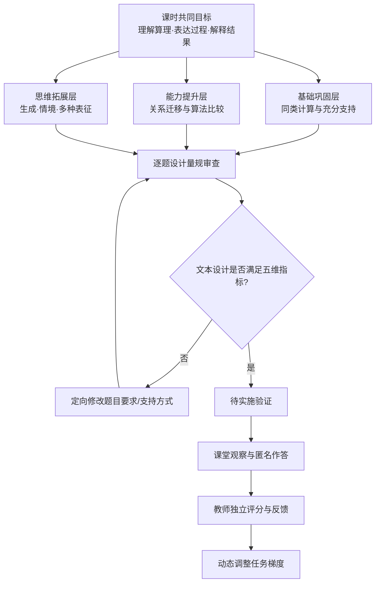

# 三层练习设计流程图

```mermaid
flowchart TD
    A[课时共同目标<br/>理解算理·表达过程·解释结果] --> B[基础巩固层<br/>同类计算与充分支持]
    A --> C[能力提升层<br/>关系迁移与算法比较]
    A --> D[思维拓展层<br/>生成·情境·多种表征]
    B --> E[逐题设计量规审查]
    C --> E
    D --> E
    E --> F{文本设计是否满足五维指标?}
    F -->|否| G[定向修改题目要求/支持方式]
    G --> E
    F -->|是| H[待实施验证]
    H --> I[课堂观察与匿名作答]
    I --> J[教师独立评分与反馈]
    J --> K[动态调整任务梯度]
```

**图注：** 这是本文设计研究的流程图。三条分支表示同一共同目标下的任务梯度，箭头表示设计与审查顺序，不表示已经验证的因果关系。课堂观察、匿名作答和教师评分属于后续验证步骤，当前没有数据。

**人工图件审核要点：**确认三层不是固定学生标签；确认“待实施验证”不会被误读为已完成；确认图注与正文的无数据声明一致。
