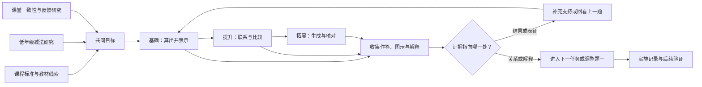

# 文献证据—任务设计—课堂反馈模型

```mermaid
flowchart LR
    A[课程标准与教材线索] --> D[共同目标]
    B[低年级减法研究] --> D
    C[课堂一致性与反馈研究] --> D
    D --> E[基础：算出并表示]
    E --> F[提升：联系与比较]
    F --> G[拓展：生成与核对]
    E --> H[收集作答、图示与解释]
    F --> H
    G --> H
    H --> I{证据指向哪一处？}
    I -->|结果或表征| J[补充支持或回看上一题]
    I -->|关系或解释| K[进入下一任务或调整题干]
    J --> E
    K --> L[实施记录与后续验证]
```

图中“课堂反馈”指教师依据学生真实作答作出的下一步教学决定。它不表示已经获得学习效果，也不把外部研究的结果替代为本班证据。
